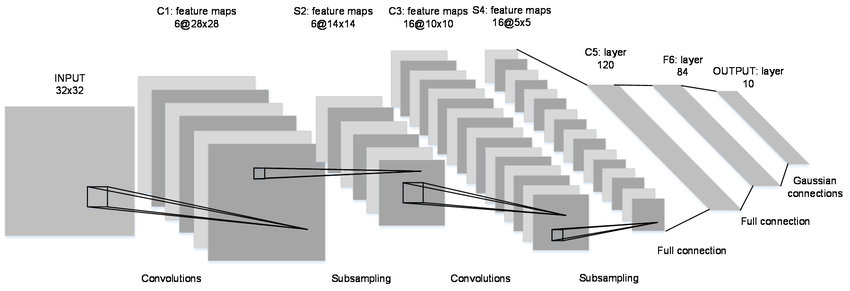

# Convolution-Neural-Net-Designer

The aim of this project is to help a student of Deep Learning understand exactly what happens under the hood of a 
Deep Learning model;without any coding from the user.

This Python based application written in pyqt allows the user to choose a model architecture and train that model on the
MNIST Data. 

The user can tweak certain model hyperparameters and visualize its effect on the various layers of the model.
As well as view performance and accuracy metrics and plot example errors. 

The Deep learning models available to the user are
 
 - LeNet
 
 
 
 - AlexNet
  
  

They have been coded out of the box using the popular machine learning libary TensorFlow and the user needs
to only modify certain hyper parameters like:

- Strides

- Filter Size

- Number of filters

Credits : 
Project developed by 
- Naser Al Ruwais ([Github](https://github.com/Nasser-ALRuwais))
- Moiz Ahmed 

Plotting functions taken from 
Hvass-Labs
